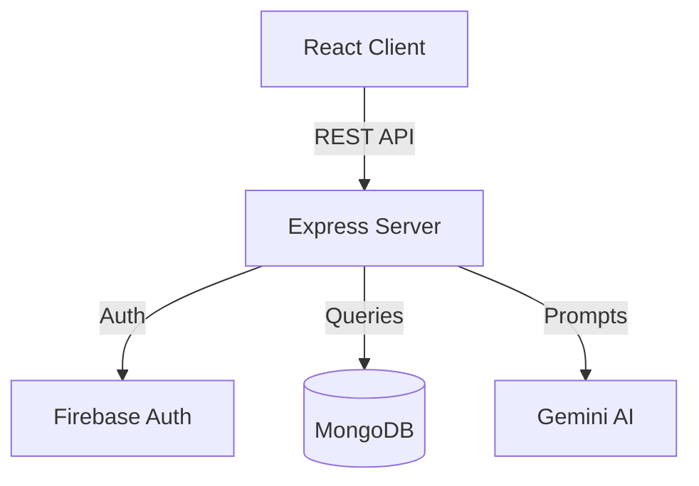

# AI-Powered Coding Assessment Platform

> A modern, full-stack coding platform that leverages Gemini AI to generate problems, assess skills, and provide intelligent feedback to developers.


## 🚀 Features

*   **AI-Generated Content**: Utilizes Google's Gemini AI to dynamically seed coding problems and skills.
*   **Modern Frontend**: Built with React 19, Vite, and TailwindCSS for a blazing fast and responsive UI.
*   **Robust Backend**: Express.js REST API with MongoDB for scalable data management.
*   **Secure Authentication**: Integrated Firebase Authentication and JWT for secure user sessions.
*   **Code Execution**: (Planned) Integrated code runner for real-time problem solving.

## 🛠️ Tech Stack

**Frontend**
*   **Framework**: [React](https://react.dev/) + [Vite](https://vitejs.dev/)
*   **Styling**: [TailwindCSS](https://tailwindcss.com/)
*   **State Management**: Redux Toolkit
*   **Icons**: Lucide React

**Backend**
*   **Runtime**: [Node.js](https://nodejs.org/)
*   **Framework**: [Express.js](https://expressjs.com/)
*   **Database**: [MongoDB](https://www.mongodb.com/) (Mongoose ODM)
*   **AI Integration**: Google Gemini AI SDK
*   **Auth**: Passport.js + JWT

## 🏗️ Architecture



## 🏁 Getting Started

### Prerequisites
*   Node.js (v18+)
*   MongoDB (Local or Atlas URI)

### Installation

1.  **Clone the repository**
    ```bash
    git clone https://github.com/yourusername/project-x.git
    cd project-x
    ```

2.  **Setup Backend**
    ```bash
    cd Backend
    npm install
    cp .env.example .env # Configure your MONGO_URI and GEMINI_API_KEY
    npm run dev
    ```

3.  **Setup Frontend**
    ```bash
    cd ../FrontEnd
    npm install
    npm run dev
    ```

## 🤝 Contributing

Contributions are welcome! Please fork the repository and submit a pull request.

## 📄 License

This project is licensed under the MIT License.
